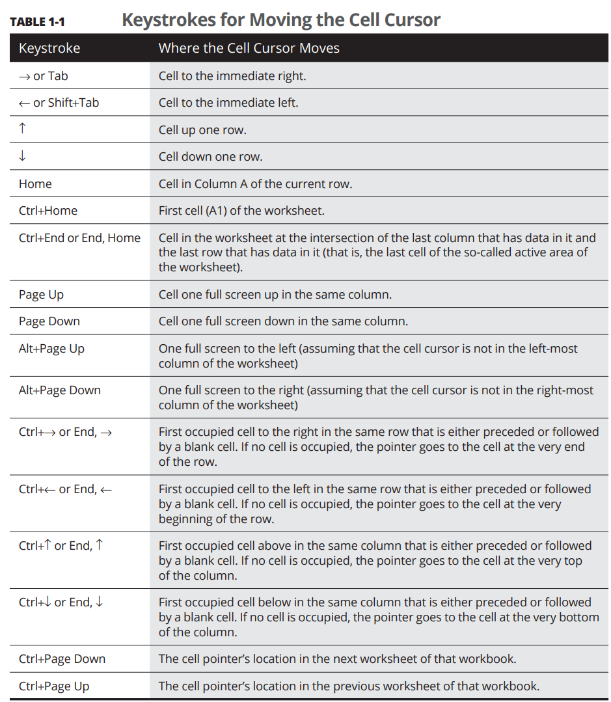

# Excel Notes

- Ctrl + F1 -> Collapse/Decollapse toolbar

- When entering formulas and using autosuggestions (select using up down arrow and click tab to select)

- F5 - to go to the desired cell (Ex. Z8)

- Shorcuts for moving around

- Scroll + Click - to move around a cell 
- SUM ->   
    - = SUM(A1:A5)
    - Alt + = 
    - SUMIF(A1:A5, ">50 ") -> to add numbers above 50 in A1 to A5
    - SUM(A1, G2 : G4, 100) -> sum A1 and g2 - g4 and 100 

- FILL -> 
    - Click the cell right side cross and (+) drag down/right to fill using AP (would need to research more)
    - Click the cell right side and double click

- SPLIT -> 
    - Home -> Fill -> Flash Fill : to fill stuff like first name automatically out of an email. (EX. pratham@gmail.com and pratham)    

    - Data -> Text to Columns -> Delimited -> Delimeters -> Destination (select top - left corner start) to seperate data using delimiters (ex. ",")

    - Split using Combo of Right/Find/Left etc (formulas), ex. : =RIGHT(C56,LEN(C56)-FIND(" ",C56))

- TRANSPOSE -> 
    - {=TRANSPOSE(C33:H34)}

- Sort and Filter ->
    - Click Home -> Sort and Filter -> A to Z to sort alphabetically.    
    
    - Select Rows from Heading to last -> Click Sort and Filter -> Click the arrow and top of row -> Select and click ok. To remove filter click arrow again and click clear.

    - You can also filter by color etc.

    - You can click arrow -> Numbers Filter to filter by average etc.

- (345) is - 345 in excel (due to accounting conventions)

- If you see a message starting with ()

- File -> Options -> Advanced -> Scroll to bottom (Edit Custom Lists) -> Enter list using commas or import from cells

- Insert -> Symbols : to insert symbols

- Select 3 cells (in a single column) and enter the formula for first cell, then press (Ctrl + Enter) to get the formula to work in all cells. 

- Formulas -> Insert Function : Alternate way of inserting function

- Home -> AutoSum : to automatically recognize the cells to sum 

- XLXS better new format, XLS older format compaitable with versions before 2007.

## Data Formatting (Making it look pretty)

- To select multiple groups of cells not adjacent to each other press ctrl while selecting, and use shift to perform the selection.

- To select an entire row/column you simply click on it's letter

- To select multiple rows/columns you drag them or ctrl click.

- Ctrl + A to select all

- Hold shift + double click in the direction of cell where you want to autoselect

- Shift + arrows to select using keyboard Or press F8 and then arrows

- Home -> Format as Table to format the table and contents 

- Use Ctrl + 1 to open format dialog or Click on bottom right number button.

- Increase decimal point, Decrease decimal point on Home tab.

- To widen cell, click on right side on column letter on top and double click, same for rows.

- To hide column 
    - Either right click on column and then click hide 
    - Home -> Format -> Hide & Unhide -> Hide Column

- To unhide column 
    - Select neighbouring n-1 & n+1 column and then Home -> Format -> Hide & Unhide -> Unhide columns     

- Checkout concat function to merge text 

- To split the text over multiple lines rather than widening the columns use Home -> Alignment -> Wrap Text

- To fit content in a cell without widening it, click Ctrl + 1, then go to alignment -> shrink to fit 

- To apply border on a cell selection -> Home -> Bored -> Choose border kind.

- To change border specifications, click Ctrl + 1, then go to border and choose specifications (thickness, color etc.)

- To fill color -> Click Ctrl + 1, click fill and choose color, etc.

- To copy formatting from one cell to another, 
    - click on Cell(to copy from) - > Format Painter -> click on cell(to copy to)
    - to copy to multiple cells, double click on format painter in the middle step above.   

- When you open files you can have different options, for ex. open as copy can help to edit a copy so you dont spoil the original

- select some cells and wait till mouse pointer become four sided arrow to drag and move them.

- Lets say there are 3 values in same column in consecutive rows and last row contains their sum, like : 
    -A1: 1 
    -B1: 2
    -C1: 23
    -D1: 26

- Now if we drag the last row two columns down i.e. F1, the formula remains same [SUM(A1:C1)] for now, but if we enter values in the middle cells (D1, E1) the formula will get updated to SUM(A1:E1).

- Press ctrl while drag and move to copy rather than move, the action will be indicated by a small +.

- Press ctrl while drag and move to insert

- To have absolute values when you autofill etc. you should double clcik a cell with formula and then select the part needed to be absolute and then click F4. The $'s will appear in formula indicating absolute values.

- Explore paste options. 

- Can use clipboard to paste previously copied stuff.

- Use delete to clear the cell contents (not delete the cell itself). Explore clear options in Home -> Clear.

- Use Home -> delete to delete the cell. Explore options.

- Use Home -> insert to insert cells. Explore options.

- To spell correct press (F7) or Review -> Spelling. Explore options.

- Use zoom slider in bottom right to zoom or ctrl + scroll.

- Split the sheet using View -> Split and do it again to remove split. Types of split :
    - Do in A Column to only do horizontal
    - Do in 1 Row to only do vertical
    - Do anywhere else to do both

- View -> Freeze panes : to freeze cells to always keeps things such as headings on screen.   

- Use Review -> Add Comment/Note or press Shift + Alt : to add/edit notes.

- Use Show all noted on Review tab to show all the notes.

- To name a cell : 
    - Either edit it's name on top left and press enter.
    - Formulas -> Defined Names -> Define Name

- To open a named cell 
    - Click on it's name on left top drop down list.
    - Home -> Find -> Go To 
    - Press F5
    - Ctrl + G

- Can use names in formulas as well.

- To find -> 
    - Home -> Find & Select -> Find
    - Ctrl + F
    - Shift + F5

- To protect sheet 
    - Go to review ->  Proctect Sheet 
    - And undo by doing same.

- Left click on bottom left to see sheets and go to one.

- Can go between sheets using 
    - Ctrl + Page Down
    - Ctrl + Page Up

- View -> New Window : To open new window of same file
    - To view all open windows use View -> Arrange all

- To do what if analysis with Data Table : Data -> What if Analysis -> Data Table

- To create a pivot table -> Select the data -> Click on lower right quick analysis tool -> Tables

- To get recommended pivot tables : Go to insert -> Pivot tables

- Format Pivot table using : Design Tab

- Analyze -> Sum of column -> Field settings -> Number format : To change format etc

- To make a chart : Insert -> Recommended Charts 

- To make specific charts there are options on right of Recommended Charts

- Select Data and press F11 to make chart instantly.